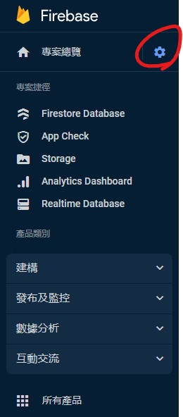
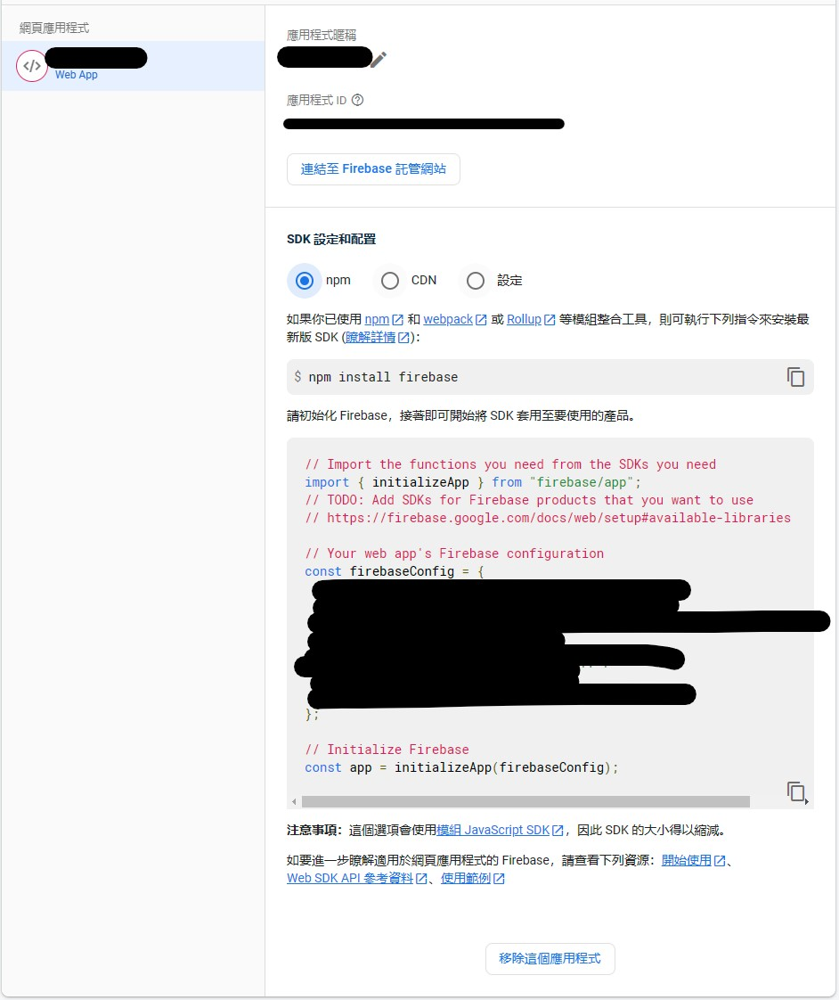
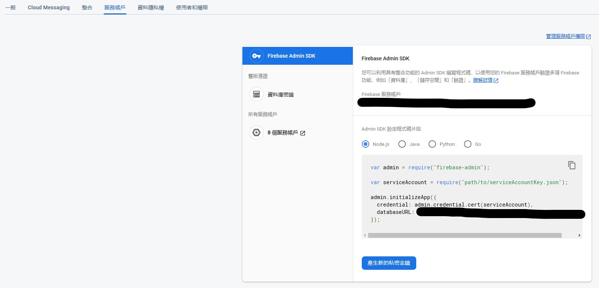

# React-Firebase-Retrieve-And-Download

這些內容firebase官方網站都有教學，但有時候還是不知道怎麼做(畢竟我的母語不是英文)。
我懂這種學習與找資料的辛苦。
我把代碼整理好讓大家可以作業。
可以透過按鈕將資料庫下載成json檔案並且之後再更新回collection中。

### 使用方法
下載後壓縮檔後，解壓縮
記得要有安裝node.js
在React-Firebase-Retrieve-And-Download下打npm i 或是 npm install 去安裝相關套件
在React-Firebase-Retrieve-And-Download/server內 也打一次npm i 或是 npm install
兩者都安裝完成後

到你的firebase專案中，看下圖的齒輪點下去，選擇專案設定

在右側的一般設定中，往下拉即可找到firebaseConfig，複製起來到React-Firebase-Retrieve-And-Download\src\lib\init-firebase.tsx檔案

再回到網頁中，去服務帳號地方 (剛剛右側的地方會找到)，去產生新的私密金鑰，並放到React-Firebase-Retrieve-And-Download\server\lib資料夾內，改名叫做serviceAccountKey.json

接著，在GitProject\React-Firebase-Retrieve-And-Download\server下打開server.js
把網頁的datasetUrl複製過去修改就完成了所有前置步驟

之後到server資料夾內打node server.js
在React-Firebase-Retrieve-And-Download下內打npm start
即可操作下載與更新firebase資料夾

# English Version
These contents are taught on the firebase official website, but sometimes I still don’t know how to do it (after all, my mother tongue is not English).
I understand the hard work of learning and finding information.
I organized the code so that everyone can work.
The database can be downloaded as a json file through the button and then updated back into the collection.
